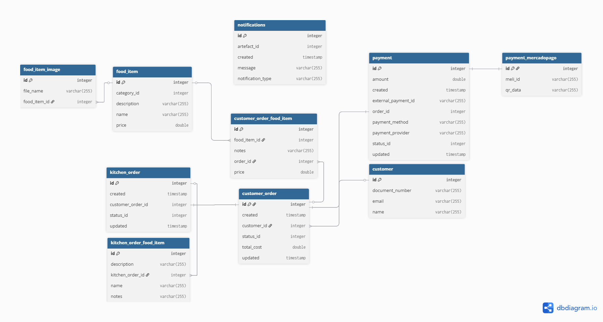
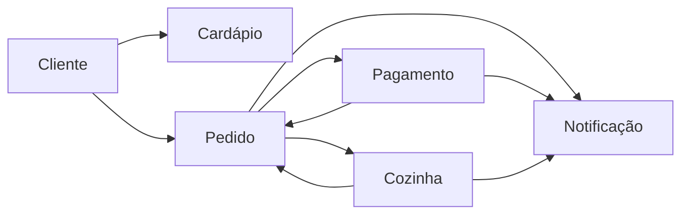

[](https://github.com/11soat-f3-lanches-caieiras/lncr-database/actions/workflows/deploy-database.yml)

# 🗄️ Infraestrutura de Banco de Dados PostgreSQL com Terraform

## 📑 Índice Único e Completo

### 🎯 Acesso Rápido
- [🚀 Início Rápido](#-início-rápido) - Comandos para deploy imediato
- [🎨 Diagrama ER Interativo](#-diagrama-er) - Visualização do banco
- [🔄 Pipeline CI/CD](#-pipeline-cicd) - Automação GitHub Actions

### 🏗️ Infraestrutura e Deploy
- [📊 Visão Geral da Arquitetura](#-visão-geral-da-arquitetura) - Diagrama AWS
- [🚀 Recursos Provisionados](#-recursos-provisionados) - Componentes AWS
- [📁 Estrutura do Projeto](#-estrutura-do-projeto) - Organização de arquivos
- [🔧 Pré-requisitos](#-pré-requisitos) - Software e recursos necessários
- [🚀 Guia de Deploy](#-guia-de-deploy) - Deploy local e produção
- [⚙️ Configuração Detalhada](#-configuração-detalhada) - Setup de ambiente

### 💾 Documentação do Banco de Dados
- [🎯 Entidades Principais](#-entidades-principais) - 10 tabelas do sistema
- [🏗️ Arquitetura do Banco](#-arquitetura-do-banco) - Design e decisões
- [🔄 Fluxo Principal do Sistema](#-fluxo-principal-do-sistema) - Diagrama de processos
- [📊 Tabelas e Campos Detalhados](#tabelas-e-campos-detalhados) - Especificação completa

### 🛠️ Recursos Técnicos
- **SGBD:** PostgreSQL 15.12
- **Cloud:** AWS RDS + Secrets Manager
- **IaC:** Terraform 1.5+
- **CI/CD:** GitHub Actions
- **Tabelas:** 10 entidades principais
- **Scripts SQL:** 5 arquivos sequenciais
- **Ambiente:** Produção AWS

### 🗂️ Componentes AWS Provisionados
| Recurso | Tipo | Descrição | Configuração |
|---------|------|-----------|--------------|
| **RDS PostgreSQL** | `db.t4g.small` | Banco de dados principal | 15.12, 20GB, Multi-AZ |
| **Secrets Manager** | Gerenciado | Credenciais seguras | Rotação automática |
| **Security Group** | `lncr-prd-rds-sg` | Isolamento de rede | CIDR 10.1.0.0/16 |
| **Subnet Group** | `lncr-prd-data-subnet-group` | Distribuição AZ | Multi-AZ habilitado |
| **GitHub Actions** | Pipeline | CI/CD automatizado | Plan → Approve → Deploy |

### 🎯 Entidades do Banco (10 Tabelas)
1. [**CUSTOMER**](#1-customer-cliente) - 👤 Gestão de clientes (CPF, email, nome)
2. [**FOOD_ITEM**](#2-food_item-item-do-cardápio) - 🍔 Catálogo de produtos (nome, preço, categoria)
3. [**FOOD_ITEM_IMAGE**](#3-food_item_image-imagens-dos-produtos) - 🖼️ Imagens dos produtos (file_name)
4. [**CUSTOMER_ORDER**](#4-customer_order-pedido) - 📝 Pedidos dos clientes (status, total_cost)
5. [**CUSTOMER_ORDER_FOOD_ITEM**](#5-customer_order_food_item-itens-do-pedido) - 📋 Itens dos pedidos (price, notes)
6. [**KITCHEN_ORDER**](#6-kitchen_order-pedido-da-cozinha) - 👨‍🍳 Pedidos da cozinha (status, timestamps)
7. [**KITCHEN_ORDER_FOOD_ITEM**](#7-kitchen_order_food_item-itens-do-pedido-na-cozinha) - 🔥 Itens da cozinha (description, notes)
8. [**PAYMENT**](#8-payment-pagamento) - 💳 Controle de pagamentos (amount, provider)
9. [**PAYMENT_MERCADOPAGO**](#9-payment_mercadopago-pagamento-mercadopago) - 💰 Extensão MercadoPago (meli_id, qr_data)
10. [**NOTIFICATIONS**](#10-notifications-notificações) - 🔔 Sistema de notificações (message, type)

### 📚 Scripts SQL (Ordem de Execução)
| Ordem | Arquivo | Descrição | Propósito |
|-------|---------|-----------|-----------|
| **1** | `1-database-config.sql` | Configurações PostgreSQL | Setup inicial do banco |
| **2** | `2-tables.sql` | Definição de tabelas | Estrutura das 10 entidades |
| **3** | `3-constraints.sql` | Chaves e relacionamentos | PKs, FKs, UNIQUEs |
| **4** | `4-sequences.sql` | Sequences auto-incremento | IDs automáticos |
| **5** | `5-indexes.sql` | Índices para performance | Otimização de consultas |

### 🔗 Links de Referência
- 🌐 **Diagrama Online:** [dbdiagram.io](https://dbdiagram.io/e/68e04206d2b621e42234ba71/68e0421bd2b621e42234bcbe)
- 📂 **Repositório GitHub:** [lncr-database](https://github.com/11soat-f3-lanches-caieiras/lncr-database)
- 🎓 **Contexto Acadêmico:** FIAP - Pós-graduação Software Architecture - Fase 3
- 🏠 **Documentação Principal:** [README do Projeto](../README.md)

### ⚡ Comandos Essenciais
```bash
# 🚀 Deploy completo
terraform init && terraform plan -var-file="prd.tfvars" && terraform apply -var-file="prd.tfvars"

# 🔍 Verificar RDS
aws rds describe-db-instances --db-instance-identifier lncr-prd-postgresql

# 🔑 Obter credenciais
SECRET_ARN=$(terraform output -raw master_user_secret_arn)
PASSWORD=$(aws secretsmanager get-secret-value --secret-id $SECRET_ARN --query SecretString --output text | jq -r .password)

# 🔗 Conectar ao banco
ENDPOINT=$(terraform output -raw db_instance_endpoint)
psql -h $ENDPOINT -p 5432 -U postgres -d lncr_database
```

---

## 🏗️ Visão Geral da Arquitetura

A infraestrutura de banco de dados foi projetada seguindo as melhores práticas de segurança, escalabilidade e alta disponibilidade:

```
┌──────────────────────────────────────────────────────────────────┐
│                           AWS Cloud                              │
├──────────────────────────────────────────────────────────────────┤
│  ┌─────────────────┐    ┌──────────────────────────────────────┐ │
│  │ Secrets Manager │    │            VPC Network               │ │
│  │ (Credentials)   │    │  ┌─────────────┐  ┌─────────────────┐│ │
│  └─────────────────┘    │  │   Public    │  │    Private      ││ │
│                         │  │   Subnets   │  │    Subnets      ││ │
│  ┌─────────────────┐    │  │             │  │                 ││ │
│  │   PostgreSQL    │    │  │ NAT Gateway │  │   EKS Cluster   ││ │
│  │   Provider      │    │  │  + IGW      │  │   + Apps        ││ │
│  └─────────────────┘    │  └─────────────┘  └─────────────────┘│ │
│                         │                                      │ │
│  ┌─────────────────┐    │  ┌─────────────┐  ┌─────────────────┐│ │
│  │   GitHub        │    │  │    Data     │  │ RDS PostgreSQL  ││ │
│  │   Actions       │    │  │   Subnets   │  │   15.12 + SG    ││ │
│  └─────────────────┘    │  └─────────────┘  └─────────────────┘│ │
│                         └──────────────────────────────────────┘ │
└──────────────────────────────────────────────────────────────────┘
```

## 🚀 Recursos Provisionados

### Componentes Principais

#### 1. **Amazon RDS PostgreSQL 15.12**
- Instância gerenciada com alta disponibilidade
- Backup automático e janelas de manutenção configuráveis
- Monitoramento integrado via CloudWatch
- Gerenciamento automático de patches de segurança

#### 2. **AWS Secrets Manager**
- Geração automática de senhas seguras
- Rotação automática de credenciais (configurável)
- Criptografia em repouso e em trânsito
- Integração nativa com RDS

#### 3. **Security Group Dedicado**
- Acesso restrito apenas da VPC interna (CIDR 10.1.0.0/16)
- Porta 5432 (PostgreSQL) configurada especificamente
- Regras de egress controladas

#### 4. **Subnet Group Existente**
- Utiliza subnet group pré-configurado: `lncr-prd-data-subnet-group`
- Distribuição em múltiplas AZs para alta disponibilidade
- Isolamento de rede para camada de dados

#### 5. **Execução Automática de Scripts SQL**
- Pipeline automatizado de criação do schema
- Ordem sequencial garantida (1-5)
- Validação de integridade pós-execução

## 📁 Estrutura do Projeto

```
lncr-database/
├── .github/
│   └── workflows/
│       └── deploy-database.yml     # Pipeline CI/CD GitHub Actions
├── modules/
│   └── rds-postegresql/
│       ├── data.tf                 # Data sources (VPC, Subnet Group)
│       ├── main.tf                 # Recursos principais (RDS, Security Group)
│       ├── outputs.tf              # Outputs do módulo
│       ├── sql.tf                  # Provider PostgreSQL e execução SQL
│       └── variables.tf            # Variáveis de entrada do módulo
├── sql/
│   ├── 1-database-config.sql       # Configurações PostgreSQL
│   ├── 2-tables.sql                # Definição de tabelas
│   ├── 3-constraints.sql           # Chaves primárias e estrangeiras
│   ├── 4-sequences.sql             # Sequences e colunas identity
│   └── 5-indexes.sql               # Índices para otimização
├── .gitignore                      # Exclusões do Git
├── data.tf                         # Data sources root (VPC)
├── main.tf                         # Chamada do módulo principal
├── prd.tfvars                      # Variáveis de produção
├── provider.tf                     # Configuração providers AWS/PostgreSQL
├── README.md                       # Esta documentação
└── variables.tf                    # Variáveis root do projeto
```

### 2. **Recursos AWS Pré-existentes**

#### VPC Configuration
- **VPC ID:** Deve existir com CIDR `10.1.0.0/16`
- **Subnets:** Mínimo 2 subnets em AZs diferentes
- **Internet Gateway:** Para acesso externo (se necessário)
- **Route Tables:** Configuradas adequadamente

#### DB Subnet Group
- **Nome:** `lncr-prd-data-subnet-group`
- **Subnets:** Distribuídas em pelo menos 2 AZs
- **Configuração:** Adequada para RDS PostgreSQL


## 🚀 Início Rápido

### 1. Clone o Repositório
```bash
git clone https://github.com/11soat-f3-lanches-caieiras/lncr-database.git
cd lncr-database
```

### 2. Configure Credenciais AWS
```bash
# Configure suas credenciais AWS
aws configure

# Ou use variáveis de ambiente
export AWS_ACCESS_KEY_ID="sua-access-key"
export AWS_SECRET_ACCESS_KEY="sua-secret-key"
export AWS_DEFAULT_REGION="us-east-1"
```

### 3. Inicialize o Terraform
```bash
terraform init
```

### 4. Valide a Configuração
```bash
terraform validate
terraform fmt
```

### 5. Planeje a Implantação
```bash
terraform plan -var-file="prd.tfvars"
```

### 6. Aplique a Infraestrutura
```bash
terraform apply -var-file="prd.tfvars"
```

### 7. Configure Conexão ao Banco
```bash
# Obter credenciais
SECRET_ARN=$(terraform output -raw master_user_secret_arn)
PASSWORD=$(aws secretsmanager get-secret-value \
  --secret-id $SECRET_ARN \
  --query SecretString --output text | jq -r .password)
ENDPOINT=$(terraform output -raw db_instance_endpoint)

# Testar conexão
psql -h $ENDPOINT -p 5432 -U postgres -d lncr_database
```

---

## ⚙️ Configuração Detalhada

### 1. **Variáveis de Ambiente (prd.tfvars)**

```hcl
# Configurações do Banco de Dados
db_name          = "lncr_database"
db_username      = "postgres"

# Configurações da Instância
instance_class   = "db.t4g.small"    # 2 vCPU, 2 GB RAM
allocated_storage = 20                # 20 GB SSD gp3

# Configurações do Ambiente
environment      = "prd"
prefix_name      = "lncr"
```

### 2. **Recursos Provisionados**

#### RDS Instance
- **Identificador:** `lncr-prd-postgresql`
- **Engine:** PostgreSQL 15.12
- **Classe:** db.t4g.small (ARM-based, otimizado para custo)
- **Storage:** 20 GB gp3 (SSD de alta performance)

#### Security Group
- **Nome:** `lncr-prd-rds-sg`
- **Ingress:** Porta 5432 apenas do CIDR 10.1.0.0/16
- **Egress:** Liberado para 0.0.0.0/0 (atualizações e patches)

#### Secrets Manager
- **Geração:** Automática pelo RDS
- **Rotação:** Configurável (30, 60, 90 dias)
- **Criptografia:** AWS KMS (chave padrão)

---

---

## 🔄 Pipeline CI/CD

### **GitHub Actions Workflow**

O projeto inclui um pipeline completo de CI/CD com as seguintes etapas:

#### **1. Plan Stage**
- Checkout do código
- Setup do Terraform 1.5.7
- Instalação do PostgreSQL Client
- Validação da configuração
- Geração do plano de execução
- Upload do artefato do plano

#### **2. Approval Stage**
- Aprovação manual obrigatória
- Aprovadores: `gustavo-log`, `titoparizotto`
- Mínimo de 1 aprovação necessária
- Issue automático no GitHub para aprovação

#### **3. Deploy Stage**
- Download do plano aprovado
- Execução do Terraform Apply
- Verificação da estrutura do banco
- Validação pós-deploy

#### **Triggers do Pipeline:**
- `repository_dispatch` com type `infra-base-completed`
- `workflow_dispatch` (execução manual)
- `workflow_call` (chamada de outros workflows)

----

# Documentação Funcional do Banco de Dados da Lanches Caieiras

## 🎯 Entidades Principais

As 10 entidades principais do sistema LNCR foram projetadas seguindo os princípios de Domain-Driven Design (DDD), organizadas em contextos delimitados para garantir baixo acoplamento e alta coesão.

### 🎨 Diagrama ER

[](https://dbdiagram.io/e/68e04206d2b621e42234ba71/68e0421bd2b621e42234bcbe)

*Clique na imagem acima para acessar o diagrama interativo*

## 🏗️ Arquitetura do Banco

A arquitetura do banco de dados foi projetada para suportar os requisitos do sistema LNCR, utilizando o PostgreSQL como SGBD. As principais decisões de design incluem:

- **Domain-Driven Design (DDD)**: Organização do banco em contextos delimitados.
- **Referências Fracas**: Utilização de FKs apenas dentro do mesmo contexto para evitar acoplamento.
- **Timestamps**: Campos de auditoria para rastreamento de alterações.
- **Extensibilidade**: Estrutura preparada para adição de novos provedores de pagamento e funcionalidades.

## 🔄 Fluxo Principal do Sistema


---

## Tabelas e Campos Detalhados

### 1. CUSTOMER (Cliente)
**Propósito:** Armazenar informações dos clientes cadastrados na lanchonete.

| Campo | Tipo | Nulo | Default | Constraints | Índices | Descrição |
|-------|------|------|---------|-------------|---------|-----------|
| id | INTEGER | NÃO | nextval('customer_id_seq') | PK | customer_id_idx | Identificador único do cliente |
| document_number | VARCHAR(255) | SIM | NULL | UNIQUE | customer_document_number_idx | CPF ou CNPJ do cliente |
| email | VARCHAR(255) | SIM | NULL | UNIQUE | customer_email_idx | Email para contato |
| name | VARCHAR(255) | SIM | NULL | - | - | Nome completo do cliente |

**Regras de Negócio:**
- Cliente pode ser anônimo (campos opcionais)
- document_number deve ser único quando informado
- email deve ser único quando informado

---

### 2. FOOD_ITEM (Item do Cardápio)
**Propósito:** Catálogo de produtos disponíveis para venda.

| Campo | Tipo | Nulo | Default | Constraints | Índices | Descrição |
|-------|------|------|---------|-------------|---------|-----------|
| id | INTEGER | NÃO | nextval('food_item_id_seq') | PK | food_item_id_idx | Identificador único do item |
| category_id | INTEGER | SIM | NULL | - | food_item_category_idx | Categoria: 1-Lanche, 2-Acompanhamento, 3-Bebida, 4-Sobremesa |
| description | VARCHAR(255) | SIM | NULL | - | - | Descrição detalhada do produto |
| name | VARCHAR(255) | SIM | NULL | UNIQUE | - | Nome único do produto |
| price | DOUBLE PRECISION | SIM | NULL | - | - | Preço unitário em reais |

**Regras de Negócio:**
- Nome deve ser único
- Preço sempre positivo
- Categoria define a organização no cardápio

---

### 3. FOOD_ITEM_IMAGE (Imagens dos Produtos)
**Propósito:** Armazenar referências às imagens dos produtos do cardápio.

| Campo | Tipo | Nulo | Default | Constraints | Índices | Descrição |
|-------|------|------|---------|-------------|---------|-----------|
| id | INTEGER | NÃO | nextval('food_item_image_id_seq') | PK | food_item_image_id_idx | Identificador único da imagem |
| file_name | VARCHAR(255) | SIM | NULL | - | - | Nome do arquivo de imagem |
| food_item_id | INTEGER | SIM | NULL | FK → food_item.id | food_item_image_food_item_id_idx | Referência ao produto |

**Regras de Negócio:**
- Um produto pode ter múltiplas imagens
- file_name deve referenciar arquivo válido no storage
- Exclusão em cascata quando produto é removido

---

### 4. CUSTOMER_ORDER (Pedido)
**Propósito:** Registrar pedidos realizados pelos clientes.

| Campo | Tipo | Nulo | Default | Constraints | Índices | Descrição |
|-------|------|------|---------|-------------|---------|-----------|
| id | INTEGER | NÃO | nextval('customer_order_id_seq') | PK | customer_order_id_idx | Identificador único do pedido |
| created | TIMESTAMP | SIM | NULL | - | customer_order_created_idx | Data/hora de criação |
| customer_id | INTEGER | SIM | NULL | - | customer_order_customer_id_idx | Referência ao cliente (opcional) |
| status_id | INTEGER | SIM | NULL | - | customer_order_status_idx | Status atual do pedido |
| total_cost | DOUBLE PRECISION | SIM | NULL | - | - | Valor total calculado |
| updated | TIMESTAMP | SIM | NULL | - | - | Última atualização |

**Status Possíveis:**
- 1: Criado
- 2: Confirmado
- 3: Em Preparo
- 4: Pronto
- 5: Entregue
- 6: Cancelado

**Regras de Negócio:**
- customer_id pode ser NULL (pedido anônimo)
- total_cost calculado automaticamente
- Timestamps para auditoria

---

### 5. CUSTOMER_ORDER_FOOD_ITEM (Itens do Pedido)
**Propósito:** Relacionar produtos aos pedidos com quantidades e observações.

| Campo | Tipo | Nulo | Default | Constraints | Índices | Descrição |
|-------|------|------|---------|-------------|---------|-----------|
| id | INTEGER | NÃO | nextval('customer_order_food_item_id_seq') | PK | customer_order_food_item_id_idx | Identificador único |
| food_item_id | INTEGER | SIM | NULL | - | - | Referência ao produto do cardápio |
| notes | VARCHAR(255) | SIM | NULL | - | - | Observações especiais |
| order_id | INTEGER | SIM | NULL | FK → customer_order.id | customer_order_food_item_order_id_idx | Referência ao pedido |
| price | DOUBLE PRECISION | SIM | NULL | - | - | Preço histórico do item |

**Regras de Negócio:**
- price registra valor no momento do pedido (histórico)
- notes para customizações ("sem cebola", "ponto da carne")
- food_item_id referência "fraca" para manter histórico

---

### 6. KITCHEN_ORDER (Pedido da Cozinha)
**Propósito:** Representar pedidos no contexto da cozinha.

| Campo | Tipo | Nulo | Default | Constraints | Índices | Descrição |
|-------|------|------|---------|-------------|---------|-----------|
| id | INTEGER | NÃO | nextval('kitchen_order_id_seq') | PK | - | Identificador único |
| created | TIMESTAMP | SIM | NULL | - | - | Quando chegou na cozinha |
| customer_order_id | INTEGER | SIM | NULL | UNIQUE | - | Referência única ao pedido original |
| status_id | INTEGER | SIM | NULL | - | - | Status na cozinha |
| updated | TIMESTAMP | SIM | NULL | - | - | Última atualização |

**Status da Cozinha:**
- 1: Recebido
- 2: Em Preparo
- 3: Pronto
- 4: Entregue

**Regras de Negócio:**
- Relacionamento 1:1 com customer_order
- Criado automaticamente quando pedido é confirmado
- Contexto isolado da cozinha

---

### 7. KITCHEN_ORDER_FOOD_ITEM (Itens do Pedido na Cozinha)
**Propósito:** Itens específicos para preparo na cozinha.

| Campo | Tipo | Nulo | Default | Constraints | Índices | Descrição |
|-------|------|------|---------|-------------|---------|-----------|
| id | INTEGER | NÃO | nextval('kitchen_order_food_item_id_seq') | PK | - | Identificador único |
| description | VARCHAR(255) | SIM | NULL | - | - | Descrição para a cozinha |
| kitchen_order_id | INTEGER | SIM | NULL | FK → kitchen_order.id | - | Referência ao pedido da cozinha |
| name | VARCHAR(255) | SIM | NULL | - | - | Nome do item |
| notes | VARCHAR(255) | SIM | NULL | - | - | Instruções de preparo |

**Regras de Negócio:**
- Dados copiados/simplificados do pedido original
- Foco nas informações necessárias para preparo
- Sem referência direta ao cardápio (snapshot)

---

### 8. PAYMENT (Pagamento)
**Propósito:** Controlar pagamentos dos pedidos.

| Campo | Tipo | Nulo | Default | Constraints | Índices | Descrição |
|-------|------|------|---------|-------------|---------|-----------|
| id | INTEGER | NÃO | nextval('payment_id_seq') | PK | - | Identificador único |
| amount | DOUBLE PRECISION | SIM | NULL | - | - | Valor do pagamento |
| created | TIMESTAMP | SIM | NULL | - | - | Data/hora de criação |
| external_payment_id | VARCHAR(255) | SIM | NULL | - | - | ID do provedor externo |
| order_id | INTEGER | SIM | NULL | UNIQUE | - | Referência única ao pedido |
| payment_method | VARCHAR(255) | SIM | NULL | - | - | PIX, cartão, dinheiro |
| payment_provider | VARCHAR(255) | SIM | NULL | - | - | MercadoPago, PagSeguro, etc. |
| status_id | INTEGER | SIM | NULL | - | - | Status do pagamento |
| updated | TIMESTAMP | SIM | NULL | - | - | Última atualização |

**Status de Pagamento:**
- 1: Pendente
- 2: Processando
- 3: Aprovado
- 4: Rejeitado
- 5: Cancelado

**Regras de Negócio:**
- Relacionamento 1:1 com pedido
- Suporte a múltiplos provedores
- Rastreamento completo do ciclo

---

### 9. PAYMENT_MERCADOPAGO (Pagamento MercadoPago)
**Propósito:** Extensão específica para pagamentos via MercadoPago.

| Campo | Tipo | Nulo | Default | Constraints | Índices | Descrição |
|-------|------|------|---------|-------------|---------|-----------|
| id | INTEGER | NÃO | - | PK, FK → payment.id | - | Herança do pagamento base |
| meli_id | VARCHAR(255) | SIM | NULL | - | - | ID específico do MercadoLibre |
| qr_data | VARCHAR(255) | SIM | NULL | - | - | Dados para geração QR Code PIX |

**Regras de Negócio:**
- Padrão de herança (Table per Type)
- Campos específicos do provedor
- Extensível para outros provedores

---

### 10. NOTIFICATIONS (Notificações)
**Propósito:** Sistema de notificações do aplicativo.

| Campo | Tipo | Nulo | Default | Constraints | Índices | Descrição |
|-------|------|------|---------|-------------|---------|-----------|
| id | INTEGER | NÃO | nextval('notifications_id_seq') | PK | - | Identificador único |
| artefact_id | INTEGER | SIM | NULL | - | - | ID do objeto relacionado |
| created | TIMESTAMP | SIM | NULL | - | - | Data/hora da notificação |
| message | VARCHAR(255) | SIM | NULL | - | - | Mensagem da notificação |
| notification_type | VARCHAR(255) | SIM | NULL | - | - | Tipo da notificação |

**Tipos de Notificação:**
- order_status: Mudança status pedido
- payment_status: Mudança status pagamento
- kitchen_update: Atualizações da cozinha
- system_alert: Alertas do sistema

**Regras de Negócio:**
- artefact_id referencia ID do objeto relacionado
- Suporte a diferentes tipos de evento
- Histórico completo de notificações

---

## Sequências Auto-incremento

Todas as tabelas principais utilizam sequências PostgreSQL:

| Tabela | Sequência | Início | Incremento |
|--------|-----------|---------|------------|
| customer | customer_id_seq | 1 | 1 |
| customer_order | customer_order_id_seq | 1 | 1 |
| customer_order_food_item | customer_order_food_item_id_seq | 1 | 1 |
| food_item | food_item_id_seq | 1 | 1 |
| food_item_image | food_item_image_id_seq | 1 | 1 |
| kitchen_order | kitchen_order_id_seq | 1 | 1 |
| kitchen_order_food_item | kitchen_order_food_item_id_seq | 1 | 1 |
| notifications | notifications_id_seq | 1 | 1 |
| payment | payment_id_seq | 1 | 1 |

---
