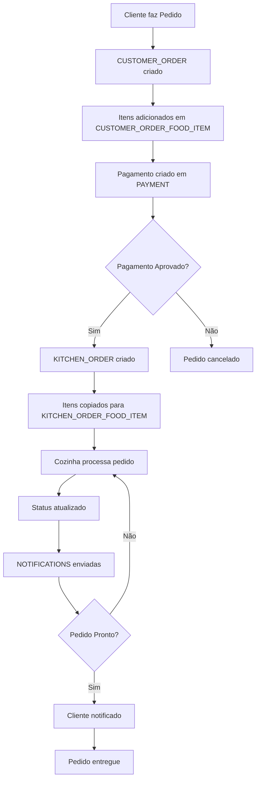
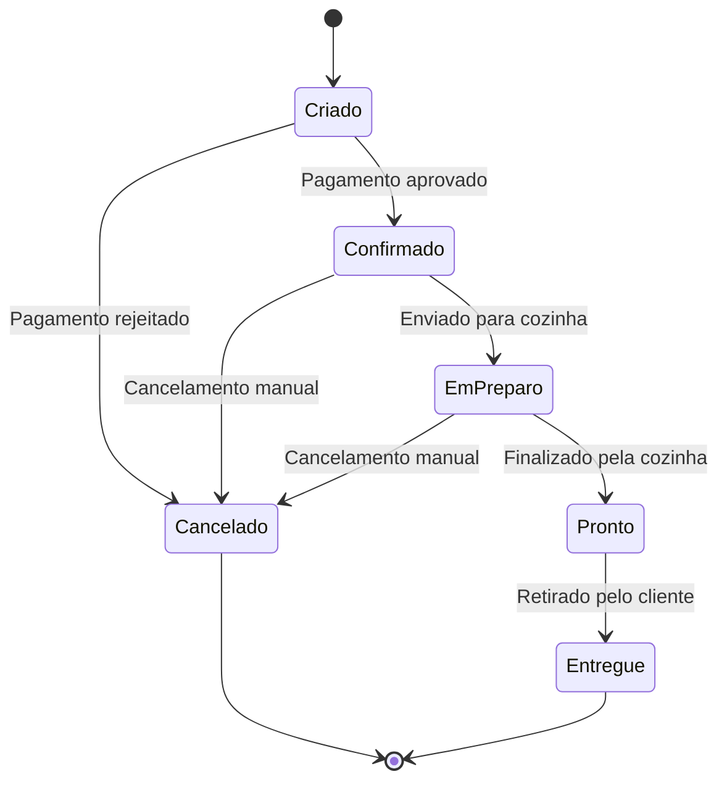

# Diagrama Entidade-Relacionamento - LNCR System

## Diagrama ER em Mermaid

```mermaid
erDiagram
    %% === DOMÍNIO DO CLIENTE ===
    CUSTOMER {
        integer id PK "Auto-increment"
        varchar document_number UK "CPF/CNPJ"
        varchar email UK "Email único"
        varchar name "Nome do cliente"
    }

    %% === DOMÍNIO DO CARDÁPIO ===
    FOOD_ITEM {
        integer id PK "Auto-increment"
        integer category_id "1-Lanche, 2-Acomp, 3-Bebida, 4-Sobremesa"
        varchar description "Descrição detalhada"
        varchar name UK "Nome único do produto"
        double price "Preço unitário"
    }

    FOOD_ITEM_IMAGE {
        integer id PK "Auto-increment"
        varchar file_name "Nome do arquivo"
        integer food_item_id FK "Referência ao item"
    }

    %% === DOMÍNIO DE PEDIDOS ===
    CUSTOMER_ORDER {
        integer id PK "Auto-increment"
        timestamp created "Data/hora criação"
        integer customer_id "Cliente (opcional)"
        integer status_id "Status do pedido"
        double total_cost "Valor total"
        timestamp updated "Última atualização"
    }

    CUSTOMER_ORDER_FOOD_ITEM {
        integer id PK "Auto-increment"
        integer food_item_id "Ref ao cardápio"
        varchar notes "Observações especiais"
        integer order_id FK "Pedido"
        double price "Preço histórico"
    }

    %% === DOMÍNIO DA COZINHA ===
    KITCHEN_ORDER {
        integer id PK "Auto-increment"
        timestamp created "Chegada na cozinha"
        integer customer_order_id UK "Pedido original"
        integer status_id "Status cozinha"
        timestamp updated "Última atualização"
    }

    KITCHEN_ORDER_FOOD_ITEM {
        integer id PK "Auto-increment"
        varchar description "Descrição p/ cozinha"
        integer kitchen_order_id FK "Pedido cozinha"
        varchar name "Nome do item"
        varchar notes "Instruções preparo"
    }

    %% === DOMÍNIO DE PAGAMENTOS ===
    PAYMENT {
        integer id PK "Auto-increment"
        double amount "Valor pagamento"
        timestamp created "Data/hora criação"
        varchar external_payment_id "ID provedor externo"
        integer order_id UK "Pedido único"
        varchar payment_method "Método pagamento"
        varchar payment_provider "Provedor"
        integer status_id "Status pagamento"
        timestamp updated "Última atualização"
    }

    PAYMENT_MERCADOPAGO {
        integer id PK-FK "Herança payment"
        varchar meli_id "ID MercadoLibre"
        varchar qr_data "Dados QR Code"
    }

    %% === NOTIFICAÇÕES ===
    NOTIFICATIONS {
        integer id PK "Auto-increment"
        integer artefact_id "ID artefato relacionado"
        timestamp created "Data/hora"
        varchar message "Mensagem"
        varchar notification_type "Tipo notificação"
    }

    %% === RELACIONAMENTOS ===
    CUSTOMER ||--o{ CUSTOMER_ORDER : "faz pedidos"
    CUSTOMER_ORDER ||--o{ CUSTOMER_ORDER_FOOD_ITEM : "contém itens"
    CUSTOMER_ORDER_FOOD_ITEM }o--|| FOOD_ITEM : "referencia item"
    FOOD_ITEM ||--o{ FOOD_ITEM_IMAGE : "possui imagens"
    
    CUSTOMER_ORDER ||--|| KITCHEN_ORDER : "gera pedido cozinha"
    KITCHEN_ORDER ||--o{ KITCHEN_ORDER_FOOD_ITEM : "contém itens"
    
    CUSTOMER_ORDER ||--|| PAYMENT : "possui pagamento"
    PAYMENT ||--|| PAYMENT_MERCADOPAGO : "extensão MercadoPago"
```

## Fluxo de Dados Principal



## Estados dos Pedidos



## Índices de Performance

| Tabela | Índice | Tipo | Objetivo |
|--------|--------|------|----------|
| customer | customer_id_idx | BTREE | PK lookup |
| customer | customer_document_number_idx | BTREE | Busca por CPF |
| customer | customer_email_idx | BTREE | Busca por email |
| customer_order | customer_order_created_idx | BTREE | Ordenação temporal |
| customer_order | customer_order_status_idx | BTREE | Filtro por status |
| food_item | food_item_category_idx | BTREE | Filtro por categoria |
| customer_order_food_item | customer_order_food_item_order_id_idx | BTREE | Join com pedidos |

## Constraints de Integridade

### Chaves Primárias
- Todas as tabelas possuem PK auto-incremento
- Sequências PostgreSQL para geração de IDs

### Chaves Únicas
- `customer.document_number` - CPF/CNPJ único
- `customer.email` - Email único  
- `food_item.name` - Nome do produto único
- `kitchen_order.customer_order_id` - Relacionamento 1:1
- `payment.order_id` - Relacionamento 1:1

### Chaves Estrangeiras (Bounded Context)
- FK apenas dentro do mesmo domínio
- Referências entre domínios mantidas como "weak references"
- Integridade garantida pela aplicação

## Observações Arquiteturais

1. **Domain-Driven Design**: Separação clara entre bounded contexts
2. **Event Sourcing**: Campos `created` e `updated` para auditoria
3. **Extensibilidade**: Tabelas específicas por provedor (ex: payment_mercadopago)
