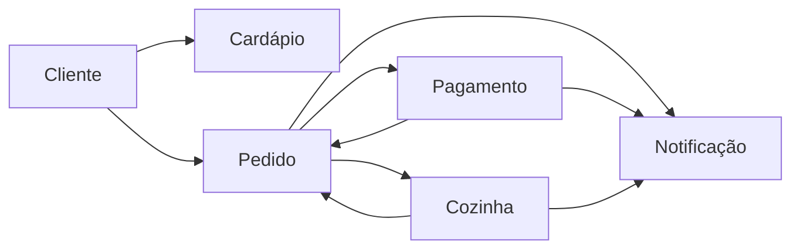

# Documentação do Banco de Dados da Lanches Caieiras

## 📑 Índice

### 📋 Navegação Rápida
- [📊 Visão Geral](#-visão-geral)
- [📁 Estrutura da Documentação](#-estrutura-da-documentação)
- [🔄 Fluxo Principal do Sistema](#-fluxo-principal-do-sistema)
- [📊 Diagrama Entidade-Relacionamento (DER)](#diagrama-entidade-relacionamento-der)
- [🏗️ Arquitetura e Decisões de Design](#arquitetura-e-decisões-de-design)
- [📖 Dicionário de Dados](#dicionário-de-dados---lncr-database)
- [🎨 Diagrama ER Interativo](#diagrama-er-interativo---lncr-database)


### 🔗 Links Úteis
- 🌐 **Diagrama Online:** [dbdiagram.io](https://dbdiagram.io/e/68e04206d2b621e42234ba71/68e0421bd2b621e42234bcbe)
- 📂 **Scripts SQL:** `../sql/` (1-database-config → 2-tables → 3-constraints → 4-sequences → 5-indexes)

### 🎯 Entidades Principais
1. [**CUSTOMER**](#1-customer-cliente) - Gestão de clientes
2. [**FOOD_ITEM**](#2-food_item-item-do-cardápio) - Catálogo de produtos
3. [**FOOD_ITEM_IMAGE**](#3-food_item_image-imagens-dos-itens) - Imagens dos produtos
4. [**CUSTOMER_ORDER**](#4-customer_order-pedido-do-cliente) - Pedidos dos clientes
5. [**CUSTOMER_ORDER_FOOD_ITEM**](#5-customer_order_food_item-itens-do-pedido) - Itens dos pedidos
6. [**KITCHEN_ORDER**](#6-kitchen_order-pedido-da-cozinha) - Pedidos da cozinha
7. [**KITCHEN_ORDER_FOOD_ITEM**](#7-kitchen_order_food_item-itens-do-pedido-da-cozinha) - Itens da cozinha
8. [**PAYMENT**](#8-payment-pagamento) - Controle de pagamentos
9. [**PAYMENT_MERCADOPAGO**](#9-payment_mercadopago-pagamento-mercadopago) - Extensão MercadoPago
10. [**NOTIFICATIONS**](#10-notifications-notificações) - Sistema de notificações

---

## 📊 Visão Geral

Este diretório contém a documentação completa do banco de dados da Lanches Caieiras, seguindo as melhores práticas de diagramação e documentação de banco de dados.

## 📁 Estrutura da Documentação

### Características Técnicas

- **SGBD:** PostgreSQL
- **Padrão:** Domain-Driven Design (DDD)
- **Relacionamentos:** Bounded contexts com referências fracas
- **Performance:** Índices otimizados para consultas frequentes
- **Auditoria:** Timestamps de criação e atualização
- **Extensibilidade:** Suporte a múltiplos provedores de pagamento

### Domínios (Bounded Contexts)

1. **👤 Cliente** - Gestão de clientes
2. **🍔 Cardápio** - Produtos e imagens
3. **📝 Pedidos** - Pedidos e itens
4. **👨‍🍳 Cozinha** - Processamento culinário
5. **💳 Pagamentos** - Processamento financeiro
6. **🔔 Notificações** - Sistema de alertas

### 🔧 Scripts SQL Relacionados

Os scripts de criação do banco estão localizados em `../sql/`:

- `1-database-config.sql` - Configurações iniciais
- `2-tables.sql` - Criação das tabelas
- `3-constraints.sql` - Chaves primárias, estrangeiras e únicas
- `4-sequences.sql` - Sequências auto-incremento
- `5-indexes.sql` - Índices de performance


## 🔄 Fluxo Principal do Sistema



## Diagrama Entidade-Relacionamento (DER)

### Entidades Principais

#### 1. **CUSTOMER** (Cliente)
Armazena informações dos clientes da lanchonete.

| Campo | Tipo | Constraints | Descrição |
|-------|------|-------------|-----------|
| id | INTEGER | PK, AUTO_INCREMENT | Identificador único do cliente |
| document_number | VARCHAR(255) | UNIQUE, INDEX | CPF/CNPJ do cliente |
| email | VARCHAR(255) | UNIQUE, INDEX | Email do cliente |
| name | VARCHAR(255) | | Nome do cliente |

**Índices:**
- `customer_id_idx` (BTREE)
- `customer_document_number_idx` (BTREE)
- `customer_email_idx` (BTREE)

---

#### 2. **FOOD_ITEM** (Item do Cardápio)
Catálogo de produtos disponíveis na lanchonete.

| Campo | Tipo | Constraints | Descrição |
|-------|------|-------------|-----------|
| id | INTEGER | PK, AUTO_INCREMENT | Identificador único do item |
| category_id | INTEGER | INDEX | Categoria do item (lanche, bebida, etc.) |
| description | VARCHAR(255) | | Descrição detalhada do item |
| name | VARCHAR(255) | UNIQUE | Nome do item |
| price | DOUBLE PRECISION | | Preço unitário |

**Índices:**
- `food_item_id_idx` (BTREE)
- `food_item_category_idx` (BTREE)

---

#### 3. **FOOD_ITEM_IMAGE** (Imagens dos Itens)
Armazena referências às imagens dos itens do cardápio.

| Campo | Tipo | Constraints | Descrição |
|-------|------|-------------|-----------|
| id | INTEGER | PK, AUTO_INCREMENT | Identificador único da imagem |
| file_name | VARCHAR(255) | | Nome do arquivo da imagem |
| food_item_id | INTEGER | FK → food_item.id, INDEX | Referência ao item |

**Relacionamentos:**
- N:1 com FOOD_ITEM

---

#### 4. **CUSTOMER_ORDER** (Pedido do Cliente)
Pedidos realizados pelos clientes.

| Campo | Tipo | Constraints | Descrição |
|-------|------|-------------|-----------|
| id | INTEGER | PK, AUTO_INCREMENT | Identificador único do pedido |
| created | TIMESTAMP | INDEX | Data/hora de criação |
| customer_id | INTEGER | INDEX | Referência ao cliente (opcional) |
| status_id | INTEGER | INDEX | Status do pedido |
| total_cost | DOUBLE PRECISION | | Valor total do pedido |
| updated | TIMESTAMP | | Data/hora da última atualização |

**Índices:**
- `customer_order_id_idx` (BTREE)
- `customer_order_customer_id_idx` (BTREE)
- `customer_order_status_idx` (BTREE)
- `customer_order_created_idx` (BTREE)

---

#### 5. **CUSTOMER_ORDER_FOOD_ITEM** (Itens do Pedido)
Relaciona itens do cardápio aos pedidos (carrinho de compras).

| Campo | Tipo | Constraints | Descrição |
|-------|------|-------------|-----------|
| id | INTEGER | PK, AUTO_INCREMENT | Identificador único |
| food_item_id | INTEGER | | Referência ao item do cardápio |
| notes | VARCHAR(255) | | Observações especiais |
| order_id | INTEGER | FK → customer_order.id, INDEX | Referência ao pedido |
| price | DOUBLE PRECISION | | Preço no momento do pedido |

**Relacionamentos:**
- N:1 com CUSTOMER_ORDER
- N:1 com FOOD_ITEM (referência sem FK)

---

#### 6. **KITCHEN_ORDER** (Pedido da Cozinha)
Representa os pedidos enviados para a cozinha.

| Campo | Tipo | Constraints | Descrição |
|-------|------|-------------|-----------|
| id | INTEGER | PK, AUTO_INCREMENT | Identificador único |
| created | TIMESTAMP | | Data/hora de criação |
| customer_order_id | INTEGER | UNIQUE | Referência única ao pedido |
| status_id | INTEGER | | Status na cozinha |
| updated | TIMESTAMP | | Última atualização |

**Relacionamentos:**
- 1:1 com CUSTOMER_ORDER (referência sem FK)

---

#### 7. **KITCHEN_ORDER_FOOD_ITEM** (Itens do Pedido da Cozinha)
Itens específicos do pedido na cozinha.

| Campo | Tipo | Constraints | Descrição |
|-------|------|-------------|-----------|
| id | INTEGER | PK, AUTO_INCREMENT | Identificador único |
| description | VARCHAR(255) | | Descrição do item |
| kitchen_order_id | INTEGER | FK → kitchen_order.id | Referência ao pedido da cozinha |
| name | VARCHAR(255) | | Nome do item |
| notes | VARCHAR(255) | | Observações especiais |

**Relacionamentos:**
- N:1 com KITCHEN_ORDER

---

#### 8. **PAYMENT** (Pagamento)
Controla os pagamentos dos pedidos.

| Campo | Tipo | Constraints | Descrição |
|-------|------|-------------|-----------|
| id | INTEGER | PK, AUTO_INCREMENT | Identificador único |
| amount | DOUBLE PRECISION | | Valor do pagamento |
| created | TIMESTAMP | | Data/hora de criação |
| external_payment_id | VARCHAR(255) | | ID do pagamento externo |
| order_id | INTEGER | UNIQUE | Referência única ao pedido |
| payment_method | VARCHAR(255) | | Método de pagamento |
| payment_provider | VARCHAR(255) | | Provedor de pagamento |
| status_id | INTEGER | | Status do pagamento |
| updated | TIMESTAMP | | Última atualização |

**Relacionamentos:**
- 1:1 com CUSTOMER_ORDER (referência sem FK)

---

#### 9. **PAYMENT_MERCADOPAGO** (Pagamento MercadoPago)
Extensão específica para pagamentos via MercadoPago.

| Campo | Tipo | Constraints | Descrição |
|-------|------|-------------|-----------|
| id | INTEGER | PK, FK → payment.id | Referência ao pagamento |
| meli_id | VARCHAR(255) | | ID do MercadoLibre |
| qr_data | VARCHAR(255) | | Dados do QR Code |

**Relacionamentos:**
- 1:1 com PAYMENT (herança)

---

#### 10. **NOTIFICATIONS** (Notificações)
Sistema de notificações do aplicativo.

| Campo | Tipo | Constraints | Descrição |
|-------|------|-------------|-----------|
| id | INTEGER | PK, AUTO_INCREMENT | Identificador único |
| artefact_id | INTEGER | | ID do artefato relacionado |
| created | TIMESTAMP | | Data/hora de criação |
| message | VARCHAR(255) | | Mensagem da notificação |
| notification_type | VARCHAR(255) | | Tipo de notificação |

---

## Relacionamentos Principais

```
CUSTOMER ||--o{ CUSTOMER_ORDER : "faz pedidos"
CUSTOMER_ORDER ||--|| KITCHEN_ORDER : "gera pedido na cozinha"
CUSTOMER_ORDER ||--|| PAYMENT : "possui pagamento"
CUSTOMER_ORDER ||--o{ CUSTOMER_ORDER_FOOD_ITEM : "contém itens"
FOOD_ITEM ||--o{ FOOD_ITEM_IMAGE : "possui imagens"
KITCHEN_ORDER ||--o{ KITCHEN_ORDER_FOOD_ITEM : "contém itens"
PAYMENT ||--|| PAYMENT_MERCADOPAGO : "pagamento específico"
```

---

## Arquitetura e Decisões de Design

### Padrões Utilizados
1. **Bounded Context**: Separação entre domínios (pedido, cozinha, pagamento)
2. **Weak References**: FKs apenas dentro do mesmo contexto
3. **Event Sourcing**: Rastreamento de mudanças com timestamps
4. **Extensibility**: Tabelas específicas por provedor de pagamento

### Índices de Performance
- Índices em chaves primárias e estrangeiras
- Índices em campos de busca frequente (email, document_number)
- Índices em campos de filtro (status_id, created)
- Índices compostos para consultas específicas

### Sequências Auto-incremento
Todas as tabelas principais utilizam sequências PostgreSQL para auto-incremento das chaves primárias, garantindo unicidade e performance.

---

# Dicionário de Dados - lncr-database

## Informações Gerais
- **Sistema:** LNCR (Lanches Caieiras)
- **SGBD:** PostgreSQL
- **Schema:** public
- **Versão:** 2.0
- **Data:** 03 de outubro de 2025

---

## Tabelas e Campos Detalhados

### 1. CUSTOMER (Cliente)
**Propósito:** Armazenar informações dos clientes cadastrados na lanchonete.

| Campo | Tipo | Nulo | Default | Constraints | Índices | Descrição |
|-------|------|------|---------|-------------|---------|-----------|
| id | INTEGER | NÃO | nextval('customer_id_seq') | PK | customer_id_idx | Identificador único do cliente |
| document_number | VARCHAR(255) | SIM | NULL | UNIQUE | customer_document_number_idx | CPF ou CNPJ do cliente |
| email | VARCHAR(255) | SIM | NULL | UNIQUE | customer_email_idx | Email para contato |
| name | VARCHAR(255) | SIM | NULL | - | - | Nome completo do cliente |

**Regras de Negócio:**
- Cliente pode ser anônimo (campos opcionais)
- document_number deve ser único quando informado
- email deve ser único quando informado

---

### 2. FOOD_ITEM (Item do Cardápio)
**Propósito:** Catálogo de produtos disponíveis para venda.

| Campo | Tipo | Nulo | Default | Constraints | Índices | Descrição |
|-------|------|------|---------|-------------|---------|-----------|
| id | INTEGER | NÃO | nextval('food_item_id_seq') | PK | food_item_id_idx | Identificador único do item |
| category_id | INTEGER | SIM | NULL | - | food_item_category_idx | Categoria: 1-Lanche, 2-Acompanhamento, 3-Bebida, 4-Sobremesa |
| description | VARCHAR(255) | SIM | NULL | - | - | Descrição detalhada do produto |
| name | VARCHAR(255) | SIM | NULL | UNIQUE | - | Nome único do produto |
| price | DOUBLE PRECISION | SIM | NULL | - | - | Preço unitário em reais |

**Regras de Negócio:**
- Nome deve ser único
- Preço sempre positivo
- Categoria define a organização no cardápio

---

### 3. FOOD_ITEM_IMAGE (Imagens dos Produtos)
**Propósito:** Armazenar referências às imagens dos produtos do cardápio.

| Campo | Tipo | Nulo | Default | Constraints | Índices | Descrição |
|-------|------|------|---------|-------------|---------|-----------|
| id | INTEGER | NÃO | nextval('food_item_image_id_seq') | PK | food_item_image_id_idx | Identificador único da imagem |
| file_name | VARCHAR(255) | SIM | NULL | - | - | Nome do arquivo de imagem |
| food_item_id | INTEGER | SIM | NULL | FK → food_item.id | food_item_image_food_item_id_idx | Referência ao produto |

**Regras de Negócio:**
- Um produto pode ter múltiplas imagens
- file_name deve referenciar arquivo válido no storage
- Exclusão em cascata quando produto é removido

---

### 4. CUSTOMER_ORDER (Pedido)
**Propósito:** Registrar pedidos realizados pelos clientes.

| Campo | Tipo | Nulo | Default | Constraints | Índices | Descrição |
|-------|------|------|---------|-------------|---------|-----------|
| id | INTEGER | NÃO | nextval('customer_order_id_seq') | PK | customer_order_id_idx | Identificador único do pedido |
| created | TIMESTAMP | SIM | NULL | - | customer_order_created_idx | Data/hora de criação |
| customer_id | INTEGER | SIM | NULL | - | customer_order_customer_id_idx | Referência ao cliente (opcional) |
| status_id | INTEGER | SIM | NULL | - | customer_order_status_idx | Status atual do pedido |
| total_cost | DOUBLE PRECISION | SIM | NULL | - | - | Valor total calculado |
| updated | TIMESTAMP | SIM | NULL | - | - | Última atualização |

**Status Possíveis:**
- 1: Criado
- 2: Confirmado
- 3: Em Preparo
- 4: Pronto
- 5: Entregue
- 6: Cancelado

**Regras de Negócio:**
- customer_id pode ser NULL (pedido anônimo)
- total_cost calculado automaticamente
- Timestamps para auditoria

---

### 5. CUSTOMER_ORDER_FOOD_ITEM (Itens do Pedido)
**Propósito:** Relacionar produtos aos pedidos com quantidades e observações.

| Campo | Tipo | Nulo | Default | Constraints | Índices | Descrição |
|-------|------|------|---------|-------------|---------|-----------|
| id | INTEGER | NÃO | nextval('customer_order_food_item_id_seq') | PK | customer_order_food_item_id_idx | Identificador único |
| food_item_id | INTEGER | SIM | NULL | - | - | Referência ao produto do cardápio |
| notes | VARCHAR(255) | SIM | NULL | - | - | Observações especiais |
| order_id | INTEGER | SIM | NULL | FK → customer_order.id | customer_order_food_item_order_id_idx | Referência ao pedido |
| price | DOUBLE PRECISION | SIM | NULL | - | - | Preço histórico do item |

**Regras de Negócio:**
- price registra valor no momento do pedido (histórico)
- notes para customizações ("sem cebola", "ponto da carne")
- food_item_id referência "fraca" para manter histórico

---

### 6. KITCHEN_ORDER (Pedido da Cozinha)
**Propósito:** Representar pedidos no contexto da cozinha.

| Campo | Tipo | Nulo | Default | Constraints | Índices | Descrição |
|-------|------|------|---------|-------------|---------|-----------|
| id | INTEGER | NÃO | nextval('kitchen_order_id_seq') | PK | - | Identificador único |
| created | TIMESTAMP | SIM | NULL | - | - | Quando chegou na cozinha |
| customer_order_id | INTEGER | SIM | NULL | UNIQUE | - | Referência única ao pedido original |
| status_id | INTEGER | SIM | NULL | - | - | Status na cozinha |
| updated | TIMESTAMP | SIM | NULL | - | - | Última atualização |

**Status da Cozinha:**
- 1: Recebido
- 2: Em Preparo
- 3: Pronto
- 4: Entregue

**Regras de Negócio:**
- Relacionamento 1:1 com customer_order
- Criado automaticamente quando pedido é confirmado
- Contexto isolado da cozinha

---

### 7. KITCHEN_ORDER_FOOD_ITEM (Itens do Pedido na Cozinha)
**Propósito:** Itens específicos para preparo na cozinha.

| Campo | Tipo | Nulo | Default | Constraints | Índices | Descrição |
|-------|------|------|---------|-------------|---------|-----------|
| id | INTEGER | NÃO | nextval('kitchen_order_food_item_id_seq') | PK | - | Identificador único |
| description | VARCHAR(255) | SIM | NULL | - | - | Descrição para a cozinha |
| kitchen_order_id | INTEGER | SIM | NULL | FK → kitchen_order.id | - | Referência ao pedido da cozinha |
| name | VARCHAR(255) | SIM | NULL | - | - | Nome do item |
| notes | VARCHAR(255) | SIM | NULL | - | - | Instruções de preparo |

**Regras de Negócio:**
- Dados copiados/simplificados do pedido original
- Foco nas informações necessárias para preparo
- Sem referência direta ao cardápio (snapshot)

---

### 8. PAYMENT (Pagamento)
**Propósito:** Controlar pagamentos dos pedidos.

| Campo | Tipo | Nulo | Default | Constraints | Índices | Descrição |
|-------|------|------|---------|-------------|---------|-----------|
| id | INTEGER | NÃO | nextval('payment_id_seq') | PK | - | Identificador único |
| amount | DOUBLE PRECISION | SIM | NULL | - | - | Valor do pagamento |
| created | TIMESTAMP | SIM | NULL | - | - | Data/hora de criação |
| external_payment_id | VARCHAR(255) | SIM | NULL | - | - | ID do provedor externo |
| order_id | INTEGER | SIM | NULL | UNIQUE | - | Referência única ao pedido |
| payment_method | VARCHAR(255) | SIM | NULL | - | - | PIX, cartão, dinheiro |
| payment_provider | VARCHAR(255) | SIM | NULL | - | - | MercadoPago, PagSeguro, etc. |
| status_id | INTEGER | SIM | NULL | - | - | Status do pagamento |
| updated | TIMESTAMP | SIM | NULL | - | - | Última atualização |

**Status de Pagamento:**
- 1: Pendente
- 2: Processando
- 3: Aprovado
- 4: Rejeitado
- 5: Cancelado

**Regras de Negócio:**
- Relacionamento 1:1 com pedido
- Suporte a múltiplos provedores
- Rastreamento completo do ciclo

---

### 9. PAYMENT_MERCADOPAGO (Pagamento MercadoPago)
**Propósito:** Extensão específica para pagamentos via MercadoPago.

| Campo | Tipo | Nulo | Default | Constraints | Índices | Descrição |
|-------|------|------|---------|-------------|---------|-----------|
| id | INTEGER | NÃO | - | PK, FK → payment.id | - | Herança do pagamento base |
| meli_id | VARCHAR(255) | SIM | NULL | - | - | ID específico do MercadoLibre |
| qr_data | VARCHAR(255) | SIM | NULL | - | - | Dados para geração QR Code PIX |

**Regras de Negócio:**
- Padrão de herança (Table per Type)
- Campos específicos do provedor
- Extensível para outros provedores

---

### 10. NOTIFICATIONS (Notificações)
**Propósito:** Sistema de notificações do aplicativo.

| Campo | Tipo | Nulo | Default | Constraints | Índices | Descrição |
|-------|------|------|---------|-------------|---------|-----------|
| id | INTEGER | NÃO | nextval('notifications_id_seq') | PK | - | Identificador único |
| artefact_id | INTEGER | SIM | NULL | - | - | ID do objeto relacionado |
| created | TIMESTAMP | SIM | NULL | - | - | Data/hora da notificação |
| message | VARCHAR(255) | SIM | NULL | - | - | Mensagem da notificação |
| notification_type | VARCHAR(255) | SIM | NULL | - | - | Tipo da notificação |

**Tipos de Notificação:**
- order_status: Mudança status pedido
- payment_status: Mudança status pagamento
- kitchen_update: Atualizações da cozinha
- system_alert: Alertas do sistema

**Regras de Negócio:**
- artefact_id referencia ID do objeto relacionado
- Suporte a diferentes tipos de evento
- Histórico completo de notificações

---

## Sequências Auto-incremento

Todas as tabelas principais utilizam sequências PostgreSQL:

| Tabela | Sequência | Início | Incremento |
|--------|-----------|---------|------------|
| customer | customer_id_seq | 1 | 1 |
| customer_order | customer_order_id_seq | 1 | 1 |
| customer_order_food_item | customer_order_food_item_id_seq | 1 | 1 |
| food_item | food_item_id_seq | 1 | 1 |
| food_item_image | food_item_image_id_seq | 1 | 1 |
| kitchen_order | kitchen_order_id_seq | 1 | 1 |
| kitchen_order_food_item | kitchen_order_food_item_id_seq | 1 | 1 |
| notifications | notifications_id_seq | 1 | 1 |
| payment | payment_id_seq | 1 | 1 |

# Diagrama ER Interativo - lncr-database

## Visualização Online do Banco de Dados

Este é o Diagrama Entidade-Relacionamento (DER) interativo do sistema LNCR, renderizado através do dbdiagram.io.

### Acesso ao Diagrama
**Link direto:** https://dbdiagram.io/e/68e04206d2b621e42234ba71/68e0421bd2b621e42234bcbe

<iframe width="560" height="315" src='https://dbdiagram.io/e/68e04206d2b621e42234ba71/68e0421bd2b621e42234bcbe'> </iframe>

### Como Usar

1. **Navegação:** Use o mouse para fazer zoom e mover o diagrama
2. **Interação:** Clique nas tabelas para ver detalhes dos campos
3. **Relacionamentos:** As linhas conectam as tabelas mostrando as foreign keys
4. **Edição:** Para editar, acesse diretamente [dbdiagram.io](https://dbdiagram.io/e/68e04206d2b621e42234ba71/68e0421bd2b621e42234bcbe)

### Recursos Disponíveis

- **Visualização completa** de todas as 10 tabelas
- **Relacionamentos visuais** entre as entidades
- **Campos detalhados** com tipos e constraints
- **Índices** e **chaves** claramente identificados
- **Enums** para status e categorias
- **Comentários** explicativos em português

### Tabelas Incluídas

1. **customer** - Cadastro de clientes
2. **food_item** - Itens do cardápio
3. **food_item_image** - Imagens dos produtos
4. **customer_order** - Pedidos dos clientes
5. **customer_order_food_item** - Itens dos pedidos
6. **kitchen_order** - Pedidos da cozinha
7. **kitchen_order_food_item** - Itens da cozinha
8. **payment** - Controle de pagamentos
9. **payment_mercadopago** - Extensão MercadoPago
10. **notifications** - Sistema de notificações

---

