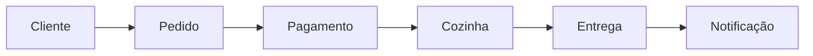

# Documentação do Banco de Dados - LNCR System

## 📊 Visão Geral

Este diretório contém a documentação completa do banco de dados do sistema LNCR (Lanches Caieiras), seguindo as melhores práticas de diagramação e documentação de banco de dados.

## 📁 Estrutura da Documentação

### 🎯 Documentos Principais

| Arquivo | Descrição | Finalidade |
|---------|-----------|------------|
| [`DATABASE_DOCUMENTATION.md`](./DATABASE_DOCUMENTATION.md) | **Documentação Técnica Completa** | Visão geral da arquitetura, relacionamentos e decisões de design |
| [`DATA_DICTIONARY.md`](./DATA_DICTIONARY.md) | **Dicionário de Dados Detalhado** | Especificação completa de todas as tabelas, campos e regras |
| [`DER_MERMAID.md`](./DER_MERMAID.md) | **Diagrama ER em Mermaid** | Visualização do DER com fluxos e estados |
| [`DER_DBML.dbml`](./DER_DBML.dbml) | **Código DBML** | Para uso no dbdiagram.io e outras ferramentas |

### 🔧 Scripts SQL Relacionados

Os scripts de criação do banco estão localizados em `../sql/`:

- `1-database-config.sql` - Configurações iniciais
- `2-tables.sql` - Criação das tabelas
- `3-constraints.sql` - Chaves primárias, estrangeiras e únicas
- `4-sequences.sql` - Sequências auto-incremento
- `5-indexes.sql` - Índices de performance

## 🎨 Visualizações Disponíveis

### 1. Diagrama ER Interativo (DBML)
- **Arquivo:** `DER_DBML.dbml`
- **Como usar:** Copie o conteúdo para [dbdiagram.io](https://dbdiagram.io)
- **Vantagens:** Interativo, editável, exportação para múltiplos formatos

### 2. Diagrama ER em Mermaid
- **Arquivo:** `DER_MERMAID.md`
- **Como usar:** Visualização direta no GitHub, GitLab, Notion
- **Vantagens:** Integrado ao markdown, fluxos de processo inclusos

## 🏗️ Arquitetura do Banco

### Domínios (Bounded Contexts)

1. **👤 Cliente** - Gestão de clientes
2. **🍔 Cardápio** - Produtos e imagens
3. **📝 Pedidos** - Pedidos e itens
4. **👨‍🍳 Cozinha** - Processamento culinário
5. **💳 Pagamentos** - Processamento financeiro
6. **🔔 Notificações** - Sistema de alertas

### Características Técnicas

- **SGBD:** PostgreSQL
- **Padrão:** Domain-Driven Design (DDD)
- **Relacionamentos:** Bounded contexts com referências fracas
- **Performance:** Índices otimizados para consultas frequentes
- **Auditoria:** Timestamps de criação e atualização
- **Extensibilidade:** Suporte a múltiplos provedores de pagamento

## 📋 Como Usar Esta Documentação

### Para Desenvolvedores
1. Leia [`DATABASE_DOCUMENTATION.md`](./DATABASE_DOCUMENTATION.md) para entender a arquitetura
2. Consulte [`DATA_DICTIONARY.md`](./DATA_DICTIONARY.md) para detalhes específicos
3. Use [`DER_DBML.dbml`](./DER_DBML.dbml) para visualização interativa

### Para Analistas/Arquitetos
1. Visualize [`DER_MERMAID.md`](./DER_MERMAID.md) para fluxos de processo
2. Analise relacionamentos em [`DATABASE_DOCUMENTATION.md`](./DATABASE_DOCUMENTATION.md)
3. Valide regras de negócio no [`DATA_DICTIONARY.md`](./DATA_DICTIONARY.md)

### Para DBAs
1. Execute scripts SQL na ordem: `1-database-config.sql` → `2-tables.sql` → `3-constraints.sql` → `4-sequences.sql` → `5-indexes.sql`
2. Configure backup seguindo políticas em [`DATA_DICTIONARY.md`](./DATA_DICTIONARY.md)
3. Monitore performance usando índices documentados

## 🔄 Fluxo Principal do Sistema

## 📊 Métricas e Performance

### Tabelas Críticas
- `customer_order` - Alta frequência de inserção/consulta
- `payment` - Transações financeiras críticas
- `kitchen_order` - Atualizações frequentes de status

### Índices de Performance
- Busca por cliente: `customer_email_idx`, `customer_document_number_idx`
- Consulta temporal: `customer_order_created_idx`
- Filtros: `customer_order_status_idx`, `food_item_category_idx`

## 🔧 Manutenção

### Rotinas Recomendadas
- **Diário:** Backup completo
- **Semanal:** VACUUM ANALYZE
- **Mensal:** Reindex tabelas críticas
- **Trimestral:** Revisão de crescimento e performance

### Monitoramento
- Crescimento das sequências
- Performance dos índices
- Tamanho das tabelas de log (notifications)

## 📞 Suporte

Para dúvidas sobre a estrutura do banco:
1. Consulte primeiro esta documentação
2. Verifique os comentários nos scripts SQL
3. Analise as constraints e relacionamentos

---

**Última atualização:** 03 de outubro de 2025  
**Versão do Schema:** 2.0  
**Responsável:** Equipe de Arquitetura LNCR
